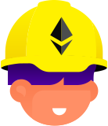
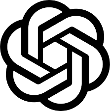

  

-----

    <h1 align="center">
      
    </h1>
  

  
-----
## ❤ About Me 💫

<h3>
  I'm a passionate blockchain developer with a strong focus on Solana, EVM, Bitcoin and so on. 
  I'm also proficient in Rust, Go, and Move, and have experience with various smart contract platforms and networks. 
  I'm always looking for new challenges and opportunities to learn and grow. 
</h3>

-----
<table width="100%">
  <tr>
    <td align="left" width="40%">
      
      <h4>
        Welcome to my GitHub profile! 
        Don't forget to ⭐star⭐ and 👍follow👍 me on GitHub.</h4>
    </td>
    <td align="right" width="50%">
      
    </td>
  </tr>
</table>

-----

### ✨ Skills 💪
<table align="center" width="100%">
  <!-- skill -->
  <tr>
    <td align="center" width="10%">
      
       Typescript
    </td>
    <td align="center" width="10%">
      
       Solidity
    </td>
    <td align="center" width="10%">
      
       Rust
    </td>
    <td align="center" width="10%">
      
       GoLang
    </td>
    <td align="center" width="10%">
      
       Move
    </td>
    <td align="center" width="10%">
      
       FunC
    </td>
    <td align="center" width="10%">
      
       Python
    </td>
    <td align="center" width="10%">
      
       Foundry
    </td>
    <td align="center" width="10%">
      
       HardHat
    </td>
    <td align="center" width="10%">
      
       Anchor
    </td>
  </tr>
  <!-- network -->
  <tr>
    <td align="center" width="10%">
      
       Solana
    </td>
    <td align="center" width="10%">
      
       Ethereum
    </td>
    <td align="center" width="10%">
      
       Bitcoin
    </td>
    <td align="center" width="10%">
      
       Aptos
    </td>
    <td align="center" width="10%">
      
       Polkadot
    </td>
    <td align="center" width="10%">
      
       Cosmos
    </td>
    <td align="center" width="10%">
      
       Polygon
    </td>
    <td align="center" width="10%">
      
       Ton
    </td>
    <td align="center" width="10%">
      
       Tron
    </td>
    <td align="center" width="10%">
      
       Sui
    </td>
  </tr>
  <tr>
    <td align="center" width="10%">
      
       C++
    </td>
    <td align="center" width="10%">
      
       Javascript
    </td>
    <td align="center" width="10%">
      
       React
    </td>
    <td align="center" width="10%">
      
       Angular
    </td>
    <td align="center" width="10%">
      
       React Native
    </td>
    <td align="center" width="10%">
      
       Next.js
    </td>
    <td align="center" width="10%">
      
       Nuxt.js
    </td>
    <td align="center" width="10%">
      
       Nest.js
    </td>
    <td align="center" width="10%">
      
       Three.js
    </td>
    <td align="center" width="10%">
      
       Tailwind
    </td>
  </tr>
  <tr>
    <td align="center" width="10%">
      
       PHP
    </td>
    <td align="center" width="10%">
      
       Laravel
    </td>
    <td align="center" width="10%">
      
       Nodejs
    </td>
    <td align="center" width="10%">
      
       Express
    </td>
    <td align="center" width="10%">
      
       Django
    </td>
    <td align="center" width="10%">
      
       Ruby
    </td>
    <td align="center" width="10%">
      
       PostgreSQL
    </td>
    <td align="center" width="10%">
      
       MongoDB
    </td>
    <td align="center" width="10%">
      
       MySQL
    </td>
    <td align="center" width="10%">
      
       Flutter
    </td>
    <!-- <td align="center" width="10%">
      
       Kotlin
    </td> -->
  </tr>
  <!-- common -->
  <tr>
    <td align="center" width="10%">
      
       OpenAI
    </td>
    <td align="center" width="10%">
      
       DeepSeek
    </td>
    <td align="center" width="10%">
      
       LangChain
    </td>
    <td align="center" width="10%">
      
       Hugging Face
    </td>
    <td align="center" width="10%">
      
       ElizaOS
    </td>
    <td align="center" width="10%">
      
       TensorFlow
    </td>
    <td align="center" width="10%">
      
       PyTorch
    </td>
    <td align="center" width="10%">
      
       Ollama
    </td>
    <td align="center" width="10%">
      
       FastAPI
    </td>
    <td align="center" width="10%">
      
       VApi
    </td>
  </tr>
</table>

-----

## <b> ✨My github's stat✨ </b>
 

<!--   <a href="https://github.com/prince777-k/"> -->
    
    
<!--   </a> -->

---
